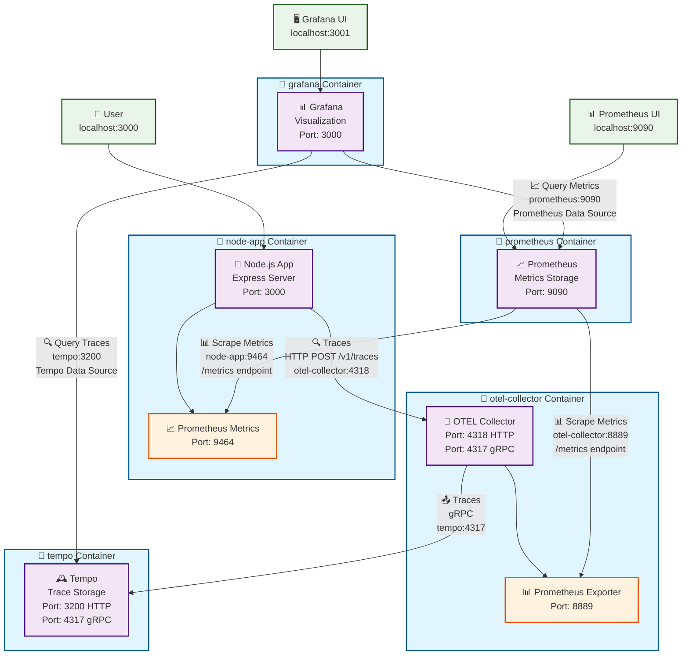

# 📊 OpenTelemetry Node.js Observability Pipeline

## 🚀 Overview

This project sets up a full observability pipeline using Docker Compose to trace and monitor a Node.js application with:

- ✅ Distributed Tracing (via **Tempo** and **Grafana**)
- ✅ Metrics (via **Prometheus** and **Grafana**)
- ✅ Auto-instrumented Node.js backend with OpenTelemetry SDK

---

## 📁 Folder Structure

```
.
├── Dockerfile                   # Node.js app Dockerfile
├── docker-compose.yml          # Compose setup for all services
├── server.js                   # Node.js server with OpenTelemetry
├── otel-setup.js               # (optional) Shared OTel config
├── package.json                # Dependencies and scripts
├── otel-collector-config.yaml  # OTel Collector config for traces + metrics
├── prometheus.yml              # Prometheus scrape targets
├── tempo.yaml                  # Tempo configuration
├── grafana-datasources.yml     # Auto-provisioned data sources
```

---

## ⚙️ Prerequisites

- 💣 Docker + Docker Compose installed
- 🧠 Basic familiarity with Docker networking

**OS Caveats:**

- On **macOS**, `host.docker.internal` is needed when referencing the host machine.
- Linux containers use service names for inter-container communication.

---

## 💠 Setup Instructions

### 1. Clone and Install Dependencies

```bash
git clone <repo-url>
cd otel-demo
npm install
```

---

### 2. Build and Start the Project

```bash
docker-compose up --build
```

---

### 3. Verify Everything is Running

| Service     | URL                                                                | Port | Purpose                        |
| ----------- | ------------------------------------------------------------------ | ---- | ------------------------------ |
| Node.js App | [http://localhost:3000/api/hello](http://localhost:3000/api/hello) | 3000 | Test endpoint                  |
| Metrics     | [http://localhost:9464/metrics](http://localhost:9464/metrics)     | 9464 | Prometheus scrape target       |
| Grafana     | [http://localhost:3001](http://localhost:3001)                     | 3001 | UI to visualize traces/metrics |
| Tempo       | No direct UI, used via Grafana                                     | 3200 | Tempo HTTP server              |
| Prometheus  | [http://localhost:9090](http://localhost:9090)                     | 9090 | Metrics explorer               |

---
Here's the complete architecture diagram showing how all the services connect! 

## Key Connection Details:

### Trace Flow (🔍)
1. **Node.js App** generates traces via OpenTelemetry SDK
2. **OTEL Collector** receives traces on port `4318` (HTTP) from `node-app`
3. **Tempo** receives traces from collector via gRPC on port `4317`
4. **Grafana** queries traces from Tempo on port `3200`

### Metrics Flow (📊)
1. **Node.js App** exposes Prometheus metrics on port `9464`
2. **OTEL Collector** exposes its own metrics on port `8889`
3. **Prometheus** scrapes both endpoints every 5 seconds
4. **Grafana** queries metrics from Prometheus on port `9090`

### Port Mapping Summary:
```
External → Internal
3000 → node-app:3000     (Express API)
3001 → grafana:3000      (Grafana UI)
9090 → prometheus:9090   (Prometheus UI)
4318 → otel-collector:4318 (OTLP HTTP)
3200 → tempo:3200        (Tempo HTTP API)
```

The beauty of this setup is that traces and metrics flow through separate pipelines but converge in Grafana for unified observability! You can correlate traces with metrics to get complete insights into your application's performance.

## 🔀 Data Flow: Trace + Metrics



---

## 📝 Code Breakdown: `server.js`

```js
const { NodeSDK } = require('@opentelemetry/sdk-node');
const { PrometheusExporter } = require('@opentelemetry/exporter-prometheus');
const { OTLPTraceExporter } = require('@opentelemetry/exporter-trace-otlp-http');
const { Resource } = require('@opentelemetry/resources');

const sdk = new NodeSDK({
  traceExporter: new OTLPTraceExporter({ url: 'http://otel-collector:4318/v1/traces' }),
  metricReader: new PrometheusExporter({ port: 9464, startServer: true }),
  resource: new Resource({ 'service.name': 'node-api' }),
  instrumentations: [getNodeAutoInstrumentations()],
});
```

---

## 📦 `docker-compose.yml` Highlights

```yaml
version: '3.9'

services:
  node-app:
    build: .
    ports:
      - 3000:3000
      - 9464:9464
    depends_on:
      - otel-collector

  otel-collector:
    image: otel/opentelemetry-collector-contrib
    command: ["--config=/etc/otel/otel-collector-config.yaml"]
    volumes:
      - ./otel-collector-config.yaml:/etc/otel/otel-collector-config.yaml
    ports:
      - "4317:4317"
      - "4318:4318"
      - "8889:8889"

  prometheus:
    image: prom/prometheus
    volumes:
      - ./prometheus.yml:/etc/prometheus/prometheus.yml
    ports:
      - 9090:9090

  tempo:
    image: grafana/tempo:latest
    command: ["-config.file=/etc/tempo.yaml"]
    volumes:
      - ./tempo.yaml:/etc/tempo.yaml
    ports:
      - 3200:3200
      - 4317:4317

  grafana:
    image: grafana/grafana
    ports:
      - 3001:3000
    volumes:
      - ./grafana-datasources.yml:/etc/grafana/provisioning/datasources/datasources.yaml
```

---

## 🔧 `otel-collector-config.yaml`

```yaml
receivers:
  otlp:
    protocols:
      grpc:
      http:

exporters:
  otlp:
    endpoint: tempo:4317
    tls:
      insecure: true
  prometheus:
    endpoint: 0.0.0.0:8889
  debug:
    verbosity: detailed

service:
  pipelines:
    traces:
      receivers: [otlp]
      exporters: [otlp, debug]
    metrics:
      receivers: [otlp]
      exporters: [prometheus, debug]
```

---

## 🔧 `prometheus.yml`

```yaml
global:
  scrape_interval: 5s

scrape_configs:
  - job_name: 'node-app'
    static_configs:
      - targets: ['node-app:9464']  # Use service name

  - job_name: 'otel-collector'
    static_configs:
      - targets: ['otel-collector:8889']
```

---

## 🔧 `tempo.yaml`

```yaml
auth_enabled: false

server:
  http_listen_port: 3200
  grpc_listen_port: 9095

distributor:
  receivers:
    otlp:
      protocols:
        grpc:
          endpoint: 0.0.0.0:4317   # Open to otel-collector
        http:
          endpoint: 0.0.0.0:4318   # Optional

ingester:
  trace_idle_period: 10s
  max_block_duration: 5m

compactor:
  compaction:
    block_retention: 1h

storage:
  trace:
    backend: local
    local:
      path: /tmp/tempo
```

---

## 📊 How to View Traces & Metrics

### 🔎 In Grafana

1. Go to [http://localhost:3001](http://localhost:3001)
2. Login: `admin` / `admin`
3. Navigate to "Explore"
4. Select:
   - **Tempo** for traces → Run `{}` to see all traces
   - **Prometheus** for metrics → Use queries like `otelcol_exporter_sent_spans`

---

## ⚠️ Gotchas & Debugging Tips

- ❌ **Traces not showing up?**

  - Check Tempo logs: Is it receiving spans?
  - Confirm `traceExporter` URL is `http://otel-collector:4318/v1/traces`

- ❌ **Metrics not scraped?**

  - Confirm Prometheus can reach `node-app:9464`
  - Curl from inside container: `docker exec -it prometheus curl node-app:9464/metrics`

- ✅ **Use **``** exporter** in OTel Collector to print traces directly.

---

## 📚 Helpful Resources

- [OpenTelemetry JS Docs](https://opentelemetry.io/docs/instrumentation/js/)
- [Grafana Tempo Docs](https://grafana.com/docs/tempo/latest/)
- [Prometheus Scraping](https://prometheus.io/docs/prometheus/latest/configuration/configuration/)
- [Grafana Explore](https://grafana.com/docs/grafana/latest/explore/)

